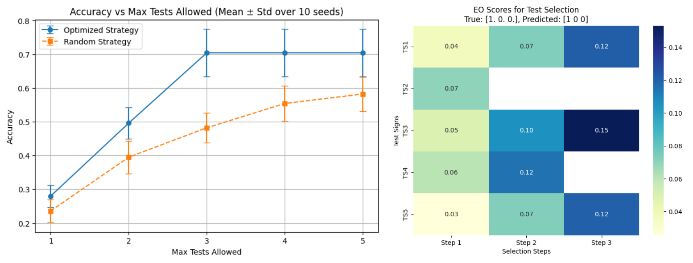

# Statistical Physics in Medical Diagnostics

This repository provides a simple implementation of a statistical physics-inspired approach to medical diagnostics, using concepts from statistical mechanics for improved disease diagnosis and test optimization. The approach is based on the work of Ramezanpour et al. (2020) and Mashaghi & Ramezanpour (2018), and it models disease diagnosis as an inference problem, where observed symptoms help infer underlying diseases.

## Background

In this approach, we combine ideas from statistical mechanics, such as the Ising model, with probabilistic inference for disease diagnosis. Unlike traditional models where symptoms are assumed independent, this method captures the complex interactions between symptoms and diseases to improve diagnostic accuracy. We aim to estimate the joint probability distribution of symptoms and diseases, infer the most likely disease(s) based on observed symptoms, and optimize test selection for efficient diagnostics.

## Key Features
- **Synthetic Data Generation**: Generates random disease-symptom data to simulate real-world patient scenarios.
- **Probabilistic Inference**: Infers the most likely diseases given observed symptoms by calculating the posterior distribution \( P(D | S) \).
- **Test Selection Strategies**: Implements both optimized and random test selection approaches, with a focus on maximizing diagnostic efficiency.
- **Evaluation**: Compares the performance of optimized test selection with random test selection based on accuracy and efficiency.

## Example Workflow

### Optimized Test Selection vs Random Test Selection

The example workflow demonstrates how the model chooses informative tests for improved diagnostic accuracy. The comparison shows how optimized test strategies outperform random test selection.

## Literature:

- Mashaghi A, Ramezanpour A. Statistical Physics of Medical Diagnostics: Study of a Probabilistic Model. Phys Rev E. 2018;97(3):032118.  https://doi.org/10.1103/PhysRevE.97.032118
- Mashaghi, A., & Ramezanpour, R. (2018). Statistical physics models in medical diagnostics: A review. *Physics Reports, 789*, 1-45.  https://doi.org/10.3390/diagnostics10110972